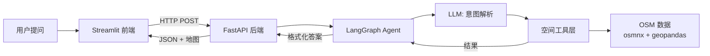

# 空间数据智能问答 Agent —— 开发设计文档

> **面试讲述版本** · 可作为项目介绍、系统设计题、Agent 架构题的回答素材

---

## 一、项目概述

### 一句话介绍

> 一个基于 **LangGraph + OpenStreetMap + LLM** 的空间数据智能问答系统，用户用自然语言提问（如"三里屯500米内有什么咖啡店"），Agent 自动完成意图解析、空间查询、结果格式化，并返回带地图标注的可视化答案。

### 我为什么做这个项目

我之前做了3年 GIS/BIM 售前解决方案，发现**空间查询对用户门槛很高**——普通人不知道怎么用 GIS 软件，甚至不知道"POI""缓冲区"是什么。

大语言模型擅长理解自然语音，osmnx/geopandas 擅长空间计算，两者结合可以做出**低门槛的空间智能问答产品**。这个方向也是**地图 + AI Agent** 的一个真实落地场景，和我要面试的 Agent 开发岗位高度契合。

---

## 二、系统架构设计

### 整体架构图



### 技术栈

| 层次 | 技术选型 | 选型理由 |
|------|---------|---------|
| LLM 编排 | **LangGraph 0.6+** | 状态机模型天然适合多步 Agent，比 LangChain LCEL 更可控 |
| 大语言模型 | **DeepSeek-chat** | 中文理解好，API 便宜，适合 Demo |
| 空间数据 | **OpenStreetMap** via osmnx | 免费、覆盖广，无需自己建数据库 |
| 空间计算 | **geopandas + shapely** | Python GIS 标准库，处理矢量数据高效 |
| 后端接口 | **FastAPI** | 异步支持好，天然适合 Agent 的流式场景 |
| 前端展示 | **Streamlit + folium** | 低代码快速出界面，folium 地图交互友好 |

---

## 三、LangGraph Agent 设计（核心）

### 为什么用 LangGraph 而不是普通 Chain？

这是面试高频问题，我总结了三点：

**1. 状态可观测**
`AgentState` 定义了完整的运行态（`user_input` → `intent` → `tool_result` → `final_response`），每一步的中间结果都落地，方便调试和日志。

**2. 条件路由**
意图解析失败可以直接跳到 `format_response` 输出错误，不需要执行无意义的空间查询。这是 DAG 做不到的。

**3. 节点可扩展**
如果后续要加「多轮对话记忆」或「RAG 知识库」，直接加节点，不影响现有流程。

### State 设计

```python
class AgentState(TypedDict):
    user_input: str        # 用户输入
    intent: str            # 解析后的意图类型
    tool_name: str         # 要调用的工具名
    tool_args: dict        # 工具参数
    tool_result: dict      # 工具执行结果
    final_response: str    # 最终回复
    error: str             # 错误信息
```

**设计决策**：将 `error` 放入 State 而非抛异常，这样 Agent 可以优雅地格式化错误信息返回给用户，而不是崩溃。

### 四个节点详解

#### Node 1：意图解析（LLM 节点）

```
用户输入 → System Prompt（定义5种意图类型）→ LLM → JSON输出
```

**为什么用 LLM 做意图解析，而不是规则/分类模型？**

空间查询的**自然语言表述高度多样化**：
- "三里屯附近的咖啡店" → buffer_search
- "三里屯500米内的咖啡店" → buffer_search（多了距离）
- "离三里屯最近的咖啡店" → nearest_poi（语义不同！）

规则引擎要写大量模板，分类模型要标注数据。LLM 零样本就能理解这些差异，泛化成本最低。

**Prompt 设计要点**（面试常问）：
- 给每种 intent 配**具体例子**，帮助 LLM 理解边界
- 要求输出 **JSON 格式**，方便程序解析
- 明确**默认值规则**（如未指定距离默认500m），减少后续补全逻辑

#### Node 2：参数校验

简单的 guard node，检查 `tool_name` 是否在 `TOOL_REGISTRY` 中。如果意图解析节点出错，这里直接标记 `intent=error`，路由到格式化节点输出错误信息。

#### Node 3：执行空间查询

从 `TOOL_REGISTRY` 字典分发到具体工具函数。每个工具函数：
- 输入：结构化参数（经纬度、半径、POI类型）
- 输出：统一格式的 dict（`{count, pois: [{name, lat, lon, distance_m}]}`）

**解耦设计**：LangGraph 节点只负责调度，不写空间计算逻辑。这样如果以后要换数据源（比如从高德换成 PostGIS），只需改工具函数，Agent 流程不受影响。

#### Node 4：结果格式化（LLM 节点）

结构化数据 → LLM → 自然语言回复

**为什么不直接拼接字符串？**

同样的结果，不同场景下用户期待的回复风格不同。LLM 可以根据 `user_input` 的语气调整输出——用户问得随意，回复也随意；用户问得正式，回复也正式。这个是模板做不到的。

---

## 四、空间工具层设计

### 工具函数清单

| 工具 | 功能 | 核心依赖 |
|------|------|---------|
| `geocode` | 地址 → 经纬度 | geopy.Nominatim（OSM 地理编码服务）|
| `reverse_geocode` | 经纬度 → 地址 | 同上 |
| `search_pois` | 按标签搜索 POI（核心函数）| osmnx.features_from_point |
| `buffer_search` | 地址 + 半径 + POI类型 | geocode + search_pois |
| `nearest_poi` | 找最近的 K 个 POI | search_pois + 按距离排序 |
| `calculate_route_info` | 两点直线距离 | geopy.geodesic |

### POI 类型映射表设计

用户说"咖啡店"，OSM 的标签是 `{"amenity": "cafe"}`。做了一个**中英文映射表**：

```python
tag_map = {
    "咖啡店": {"amenity": "cafe"},
    "餐厅": {"amenity": "restaurant"},
    "超市": {"shop": "supermarket"},
    # ... 20+ 种类型
}
```

**面试亮点**：这个设计降低了用户的认知负担——不懂 GIS 的人也能用。如果面试问"你怎么处理用户输入的自由度"，这就是一个具体例子。

### osmnx 数据缓存机制

osmnx 第一次查询某个区域时会从 OSM 服务器下载数据，比较慢（几秒到几十秒）。之后会**本地缓存**，第二次查询同一个区域是毫秒级。

**面试可扩展话题**：如果要做生产级部署，可以提前用 `ox.features_from_place()` 把热门城市的数据预加载到本地，彻底消除首次查询延迟。

---

## 五、前后端设计

### FastAPI 后端

```python
@app.post("/ask")
async def ask(req: QueryRequest):
    result = agent.invoke({"user_input": req.question, "error": ""})
    return {
        "intent": result.get("intent", ""),
        "tool_name": result.get("tool_name", ""),
        "tool_result": result.get("tool_result", {}),
        "answer": result["final_response"],
    }
```

**为什么返回 `tool_result` 而不只是 `answer`？**

因为前端要在地图上**标注 POI 位置**，`answer` 是纯文本，没有经纬度信息。`tool_result` 里的 `pois` 列表包含每个 POI 的 `lat/lon`，前端直接用来画 marker。

这是**Agent 输出结构化的实际价值**——不仅给人看，还能驱动下游可视化。

### Streamlit 前端

前端做了三件事：
1. **聊天界面**：Streamlit 原生 `st.chat_input` + 消息历史
2. **结构化展示**：用 `st.dataframe` 展示 POI 列表，`st.metric` 展示意图和工具调用
3. **地图可视化**：folium 画 POI 聚类标注（`MarkerCluster`）

---

## 六、当前局限与改进方向

面试时主动说"不足"会显得你思考深入。我总结了几点：

| 不足 | 改进方案 | 技术复杂度 |
|------|---------|-----------|
| 首次查询慢（OSM 下载） | 预加载热门城市数据；换国内数据源（高德/百度）| 低 |
| 没有多轮对话记忆 | 加 `MemorySaver` checkpoint；把历史消息传给 LLM | 中 |
| POI 类型覆盖有限 | 接入 RAG，让 LLM 根据用户输入动态生成 OSM 标签 | 中 |
| 只支持点查询，不支持"帮我规划一条跑步路线" | 接入 OSMNx 路网路由功能 | 高 |
| 没有评估体系 | 建测试集，用 DeepEval 做 Answer Relevance 评估 | 中 |

---

## 七、面试高频问题 & 我的回答思路

### Q1：为什么选 LangGraph 而不是 AutoGPT / MetaGPT 这类框架？

> LangGraph 是**可控的 Agent 框架**，流程由我显式定义，每个节点的输入输出都清晰。AutoGPT 这类框架自动化程度更高，但可控性差，不适合需要稳定输出的生产场景。我的场景只有4个节点，LangGraph 的 StateGraph 刚好够用，也不过度设计。

### Q2：如果 POI 数据量很大（比如全北京的餐厅），你的工具层怎么优化？

> 当前方案是 osmnx 一次性拉取全部数据到内存，确实不适合大规模场景。优化方向有两个：
> 1. **换数据源**：用 Overpass API 支持的空间范围查询，按需拉取
> 2. **加空间索引**：把 POI 存入 PostGIS，建 GIST 索引，`ST_DWithin` 做半径查询，数据量大时优势明显

### Q3：LLM 意图解析如果出错了怎么办？

> 三层防护：
> 1. **Prompt 约束**：要求输出 JSON，给出每种 intent 的明确例子
> 2. **输出校验**：Node 2 检查 `tool_name` 是否在注册表中
> 3. **降级策略**：解析失败时不崩溃，而是把原始输入交给 LLM 做通用回答

### Q4：你的项目跟市面上的「地图 + AI」产品比，优势在哪？

> 市面上的产品（如百度地图 AI 对话）是**闭合系统**，用户只能问它们支持的问题。我的 Agent 是**开放架构**，工具函数可以任意扩展——今天加一个「查房价」工具，明天加一个「查空气质量」工具，不需要改 Agent 主体逻辑。

---

## 八、如果面试官让你现场画架构图

用这张图（白板/在线工具均可）：

```
[用户] → [前端 Streamlit]
              ↓
[FastAPI] → [LangGraph Agent]
              ↓
    ┌───────┴───────┐
    ↓       ↓        ↓
[LLM解析] [工具调度] [LLM格式化]
    ↓       ↓        ↓
[OSM数据] [geopandas] [返回JSON+地图]
```

**关键说清楚三件事**：
1. 状态怎么在节点间传递（AgentState）
2. LLM 在哪两步用了，为什么这两步需要 LLM
3. 工具层怎么解耦，方便扩展

---

*文档版本：v1.0 | 更新日期：2026-05-25*
